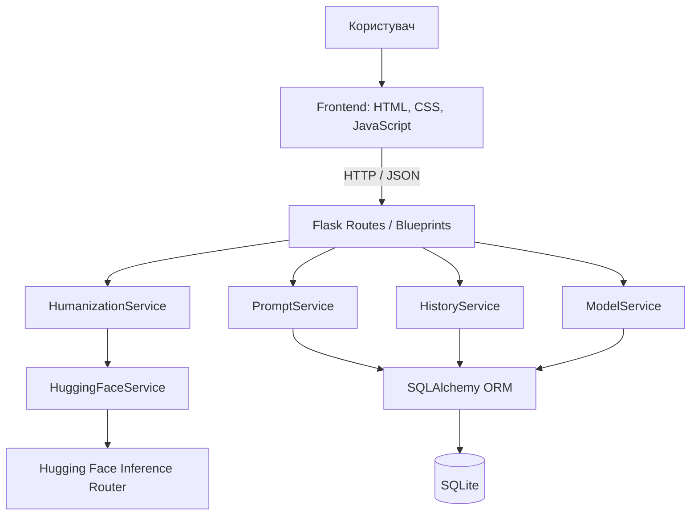

# Архітектурна діаграма

```mermaid
flowchart TD
    U[Користувач] --> FE[Frontend: HTML, CSS, JavaScript]
    FE -->|HTTP / JSON| API[Flask Routes / Blueprints]
    API --> HS[HumanizationService]
    API --> PS[PromptService]
    API --> HIS[HistoryService]
    API --> MS[ModelService]
    HS --> HFS[HuggingFaceService]
    HFS --> HF[Hugging Face Inference Router]
    PS --> ORM[SQLAlchemy ORM]
    HIS --> ORM
    MS --> ORM
    ORM --> DB[(SQLite)]
```
