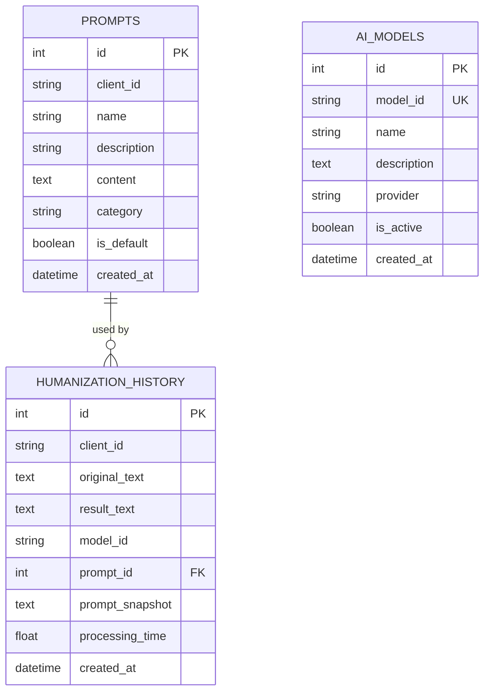

# ER-діаграма

```mermaid
erDiagram
    PROMPTS ||--o{ HUMANIZATION_HISTORY : "used by"
    PROMPTS {
        int id PK
        string client_id
        string name
        string description
        text content
        string category
        boolean is_default
        datetime created_at
    }
    AI_MODELS {
        int id PK
        string model_id UK
        string name
        text description
        string provider
        boolean is_active
        datetime created_at
    }
    HUMANIZATION_HISTORY {
        int id PK
        string client_id
        text original_text
        text result_text
        string model_id
        int prompt_id FK
        text prompt_snapshot
        float processing_time
        datetime created_at
    }
```

`humanization_history.model_id` — текстове поле без зовнішнього ключа на `ai_models`. `prompt_id` nullable; для зовнішнього ключа задано `ON DELETE SET NULL`.
