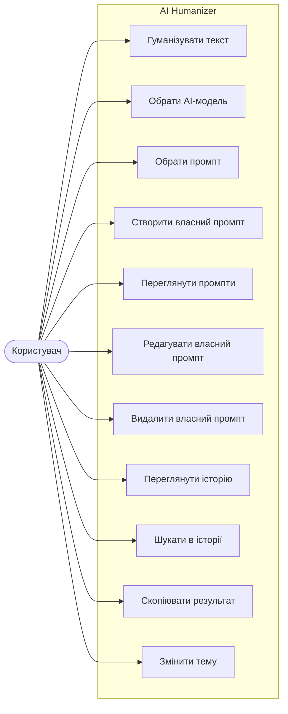

# Діаграма варіантів використання

```mermaid
flowchart LR
    User([Користувач])
    subgraph App[AI Humanizer]
        H[Гуманізувати текст]
        M[Обрати AI-модель]
        P[Обрати промпт]
        CP[Створити власний промпт]
        VP[Переглянути промпти]
        EP[Редагувати власний промпт]
        DP[Видалити власний промпт]
        VH[Переглянути історію]
        SH[Шукати в історії]
        C[Скопіювати результат]
        T[Змінити тему]
    end
    User --> H
    User --> M
    User --> P
    User --> CP
    User --> VP
    User --> EP
    User --> DP
    User --> VH
    User --> SH
    User --> C
    User --> T
```

Видалення записів історії не включено: відповідної дії в поточному Frontend немає.
